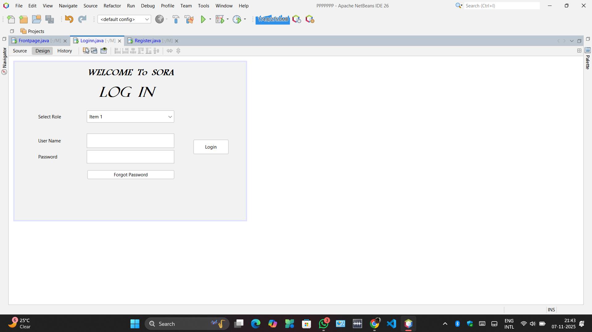
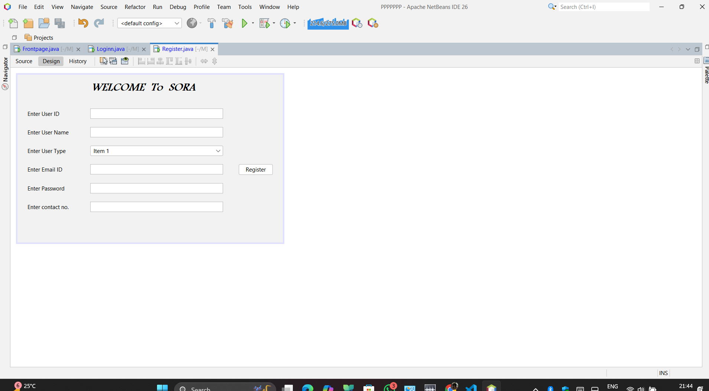
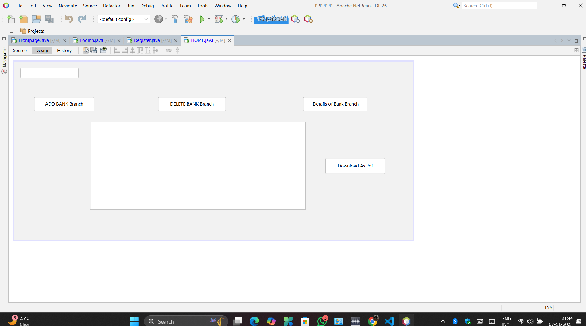
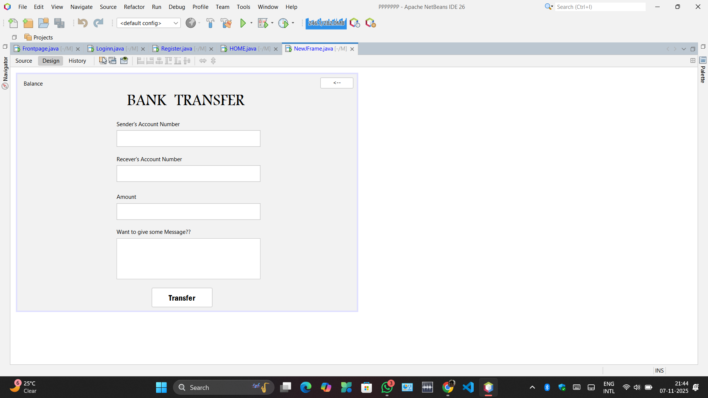
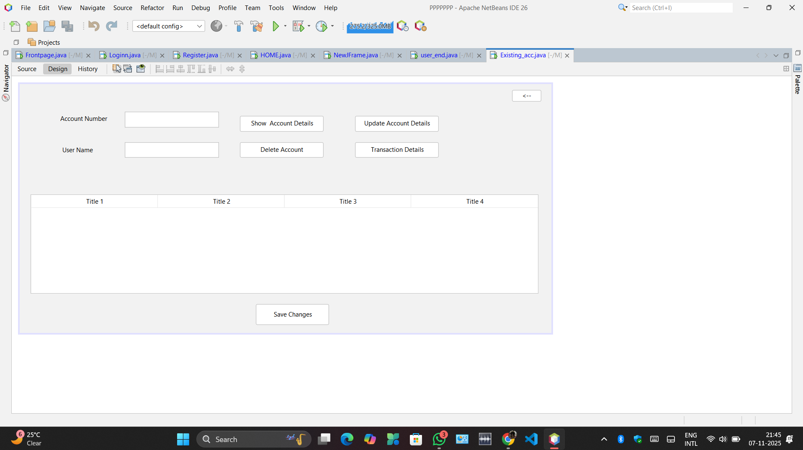

<h1 align="center" style="color:#00E5FF;">💳 SORA Banking Management System</h1>

<p align="center">
  <b style="font-size:18px;color:#FFD700;">A Modern JAVA Swing Based Banking Application</b><br>
  <i style="color:#87CEFA;">Secure • Scalable • Optimized</i><br><br>

  
  
  
</p>

---

## 🏦 About the Project

The **SORA Banking System** is a desktop banking software built using **Java Swing & JDBC**.  
It allows **admins & users** to manage banking operations such as:

✅ User Login & Registration  
✅ Account Management  
✅ Fund Transfer  
✅ Withdrawal & Deposit  
✅ Loan Handling  
✅ Branch Management  
✅ PDF Report Download  

---

## ⚙️ Tech Stack

| Category | Tools |
|---|---|
| Language | Java |
| GUI | Swing, AWT |
| IDE | Apache NetBeans |
| Database | MySQL / JDBC |
| Build System | Ant / Maven |
| Version Control | Git & GitHub |

---

## ✨ Features

- 🔐 Secure Login System  
- 👤 Admin & User Panels  
- 🧾 Transaction History  
- 💰 Deposit, Withdraw, Transfer  
- 🏛️ Bank Branch Manager  
- 📄 Export PDF  
- 🎨 Clean GUI built in NetBeans  

---

## 📸 Screenshots & UI Preview

### 🔐 Login Screen  
  
<p><i style="color:#00FFAA;">Secure login form with role selection for Admin/User validation.</i></p>

---

### 🧾 Registration Screen  
  
<p><i style="color:#00FFAA;">Users can register by providing username, password, contact info, and role.</i></p>

---

### 🏦 Admin Home (Branch Management)  
  
<p><i style="color:#00FFAA;">Admin panel to manage bank branches, add/delete branches and view information.</i></p>

---

### 💸 Bank Transfer Screen  
  
<p><i style="color:#00FFAA;">Transfer money securely between accounts with message note support.</i></p>


### 📂 Manage Existing Accounts  
  
<p><i style="color:#00FFAA;">Admin view for searching, updating and deleting bank accounts.</i></p>

---

## 🚀 Running the Project

```bash
git clone https://github.com/YourUserName/SORA-Banking-System.git
cd SORA-Banking-System
